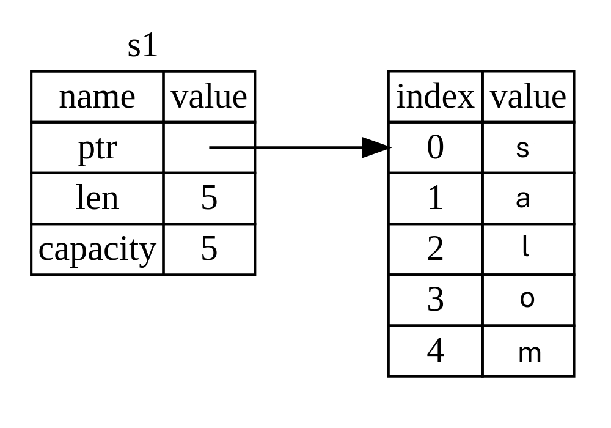
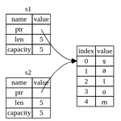
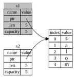

## Ownership Nima?

*Ownership*(Egalik) bu Rust dasturi xotirani qanday boshqarishini boshqaradigan qoidalar to'plami.
Barcha dasturlar ishlayotgan vaqtda kompyuter xotirasidan qanday foydalanishini boshqarishi kerak.
Ba'zi tillarda axlat yig'ish(garbage collection) mavjud bo'lib, ular dastur ishlayotgan paytda ishlatilmaydigan xotirani muntazam ravishda qidiradi; boshqa tillarda dasturchi xotirani aniq ajratishi va bo'shatishi kerak. Rust uchinchi yondashuvdan foydalanadi: xotira kompilyator tekshiradigan qoidalar to'plamiga ownership tizimi orqali boshqariladi. Agar biron bir qoidalar buzilgan bo'lsa, dastur kompilatsiya qilinmaydi. Ownership xususiyatlarining hech biri dasturingiz ishlayotgan vaqtda sekinlashtirmaydi.

Ownership ko'plab dasturchilar uchun yangi tushuncha bo'lganligi sababli, unga ko'nikish uchun biroz vaqt kerak bo'ladi. Yaxshi xabar shundaki, siz Rust va ownership tizimi qoidalari bilan qanchalik tajribali bo'lsangiz, xavfsiz va samarali kodni tabiiy ravishda ishlab chiqish osonroq bo'ladi. Unda davom etamiz!

Ownershipni tushunganingizda, Rustni noyob qiladigan xususiyatlarni tushunish uchun mustahkam asosga ega bo'lasiz. Ushbu bobda, siz juda keng tarqalgan ma'lumotlar tuzilishiga qaratilgan ba'zi misollarni orqali  ownershipni ishlashini o'rganasiz: string.

> ### Stack va Heap
>
> Ko'pgina dasturlash tillari stack va heap haqida tez-tez o'ylashingizni talab qilmaydi.
> Ammo Rust kabi tizim dasturlash tilida qiymat stackda yoki heapda bo'ladimi,
> til o'zini qanday tutishiga ta'sir qiladi va nima uchun siz ma'lum qarorlar
> qabul qilishingiz kerak. Ownershipning qismlari stack va heapga nisbatan keyinchalik
> ushbu bobda tasvirlanadi, shuning uchun bu yerda tayyorgarlik jarayonida qisqacha 
> tushuntirish berilgan.
>
> Stack ham, heap ham runtimeda foydalanish uchun kodingiz uchun mavjud bo'lgan 
> xotira qismlaridir, lekin ular turli yo'llar bilan tuzilgan. Stack qiymatlarni
> ularni olgan tartibda saqlaydi va qiymatlarni teskari tartibda o'chiradi
> Bu *oxirgi kelgan, birinchi chiqqan* deb ataladi. Plitalar stackini o'ylab
> ko'ring: ko'proq plastinka qo'shsangiz, ularni qoziqning ustiga qo'yasiz va plastinka
> kerak bo'lganda, siz yuqoridan birini olib qo'yasiz. Plitalarni o'rtadan yoki pastdan
> qo'shish yoki olib tashlash ham ishlamaydi! Ma'lumotlarni qo'shish *stackga qo'shish*,
> ma'lumotlarni olib tashlash esa *stackdan o'chirish* deb ataladi. Stackda saqlangan
> barcha ma'lumotlar ma'lum, qat'iy belgilangan hajmga ega bo'lishi kerak. Kompilyatsiya vaqtida
> noma'lum o'lchamli yoki o'zgarishi mumkin bo'lgan o'lchamdagi ma'lumotlar esa heapda
> saqlanishi kerak.
>
> heap kamroq tartibga solingan: ma'lumotlarni heapga qo'yganingizda, ma'lum miqdorda
> bo'sh joy talab qilasiz. Xotira ajratuvchisi(memory allocator) heapda yetarlicha katta bo'lgan bo'sh joyni
> topadi, uni ishlatilayotgan deb belgilaydi va o'sha joyning manzili bo'lgan
> *pointerni* ni qaytaradi. Bu jarayon *heap allocating* deb ataladi va ba'zan
> faqat *allocating* deb qisqartiriladi (qiymatlarni stackga qo'shish ajratish
> hisoblanmaydi). Heapga pointer ma'lum, qat'iy o'lcham bo'lgani uchun siz
> pointerni stackda saqlashingiz mumkin, lekin yaroqli ma'lumotlarni
> olishni istasangiz, pointergaga amal qilishingiz kerak. Restoranda o'tirganingizni
> o'ylab ko'ring. Kirish paytida siz guruhingizdagi odamlar sonini bildirasiz
> va uy egasi hammaga mos keladigan bo'sh stol topadi va sizni u yerga olib boradi.
> Agar guruhingizdagi kimdir kechikib kelsa, sizni topish uchun qayerda o'tirganingizni
> so'rashi mumkin.
>
> stackga qo'shish heapda allocating qilishdan tezroq bo'ladi, chunki allacator hech
> qachon yangi ma'lumotlarni saqlash uchun joy izlamasligi kerak; bu joy har doim
> stackning yuqori qismida joylashgan. Nisbatan, heapda bo'sh joy ajratish ko'proq
> mehnat talab qiladi, chunki allacator avval ma'lumotlarni saqlash uchun yetarlicha
> katta joy topishi va keyingi allocatinga tayyorgarlik ko'rish uchun buxgalteriya
> hisobini amalga oshirishi kerak.
>
> Heapdagi ma'lumotlarga kirish stackdagi ma'lumotlarga kirishdan ko'ra sekinroq, chunki u yerga 
> borish uchun pointerga amal qilishingiz kerak. Zamonaviy protsessorlar xotirada
> kamroq o'tishsa, tezroq ishlaydi. O'xshashlikni davom ettirib, ko'plab jadvallardan
> buyurtmalarni qabul qiladigan restoran serverini ko'rib chiqing. Keyingi stolga o'tishdan oldin
> barcha buyurtmalarni bitta stolda olish eng samarali hisoblanadi. A jadvalidan
> buyurtma olish, keyin B jadvalidan buyurtma olish, keyin yana A dan va yana B dan bitta
> buyurtma olish ancha sekinroq jarayon bo'ladi. Xuddi shu qoidaga ko'ra,
> protsessor uzoqroqda emas (u heapda bo'lishi mumkin) emas, balki boshqa
> ma'lumotlarga yaqin (stackdagi kabi) ma'lumotlarda ishlasa, o'z ishini yaxshiroq
> bajarishi mumkin.
>
> Sizning kodingiz funksiyani chaqirganda, funksiyaga o'tgan qiymatlar (shu jumladan, potentsial,
> heapdagi ma'lumotlarga pointerlar) va funksiyaning mahalliy o'zgaruvchilari
> stackga qo'shiladi. Funktsiya tugagach, bu qiymatlar stackdan chiqariladi.
>
> Kodning qaysi qismlari heapda qaysi ma'lumotlardan foydalanayotganini kuzatib borish,
> heapdagi takroriy ma'lumotlar miqdorini minimallashtirish va bo'sh joy qolmasligi uchun
> heapdagi foydalanilmagan ma'lumotlarni tozalash - bularning barchasi ownership hal qiladigan 
> muammolardir. Ownershipni tushunganingizdan so'ng, stack va heap haqida tez-tez
> o'ylashingiz shart emas, lekin ownership qilishning asosiy maqsadi heap
> ma'lumotlarni boshqarish ekanligini bilish uning nima uchun shunday ishlashini
> tushuntirishga yordam beradi.

### Ownership qoidalari

Birinchidan, ownership qoidalarini ko'rib chiqaylik.Biz ularni ko'rsatadigan misollar bilan ishlashda ushbu qoidalarni yodda tuting:

* Rust-dagi har bir qiymat *owner*ga ega.
* Bir vaqtning o'zida faqat bitta owneri bo'lishi mumkin.
* Owneri amaldan tashqariga chiqsa, qiymat o'chiriladi.

### O'zgaruvchan Scope

Endi biz Rustning asosiy sintaksisidan o‘tganimiz uchun, biz barcha `fn main() {` kodini misollarga kiritmaymiz, shuning uchun agar kuzatib boradigan bo‘lsangiz, quyidagi misollarni `main` funksiyasiga qo‘lda kiritganingizga ishonch hosil qiling. Natijada, bizning misollarimiz biroz ixchamroq bo'ladi, bu bizga boilerplate kodiga emas, balki haqiqiy tafsilotlarga e'tibor berishga imkon beradi.

Ownershipning birinchi misoli sifatida biz ba'zi o'zgaruvchilarning *scope*ni ko'rib chiqamiz. Scope - dastur doirasidagi element amal qiladigan diapazon. Quyidagi o'zgaruvchini oling:

```rust
let s = "salom";
```

`s` o'zgaruvchisi satr literaliga ishora qiladi, bu yerda satr qiymati dasturimiz matniga qattiq kodlangan. O'zgaruvchi e'lon qilingan paytdan boshlab joriy *scopning* oxirigacha amal qiladi. 4-1 ro'yxatida `s` o'zgaruvchisi qayerda to'g'ri bo'lishini izohlovchi izohlar bilan dastur ko'rsatilgan.

```rust
{{#rustdoc_include ../listings/ch04-understanding-ownership/listing-04-01/src/main.rs:here}}
```

<span class="caption">Ro'yxat 4-1: O'zgaruvchi va uning amal qiladigan doirasi</span>

Boshqacha qilib aytganda, bu yerda ikkita muhim nuqta bor:

* Qachonki `s` *scopega* kirsa, u amal qiladi.
* U scopedan tashqariga *chiqmaguncha* amal qiladi.

Ushbu nuqtada, scopelar va o'zgaruvchilarning yaroqliligi o'rtasidagi munosabatlar boshqa dasturlash tillaridagiga o'xshaydi. Endi biz `String` turini joriy qilish orqali ushbu tushunchaga asoslanamiz.

### `String` turi

Ownership qoidalarini tasvirlash uchun bizga 3-bobning [”Ma'lumotlar turlari”][data-types]<!-- ignore -->
bo'limida ko'rib chiqilganlarga qaraganda murakkabroq ma'lumotlar turi kerak. Oldin ko'rib chiqilgan turlar ma'lum o'lchamga ega bo'lib, ular stackda saqlanishi va qo'llanilish doirasi tugagach, stackdan o'chirilishi mumkin va agar kodning boshqa qismi foydalanishi kerak bo'lsa yangi, mustaqil misol yaratish uchun tez va ahamiyatsiz nusxa ko'chirilishi mumkin kodning boshqa qismi bir xil qiymatni boshqa doirada ishlatishi kerak. Ammo biz heapda saqlangan ma'lumotlarni ko'rib chiqmoqchimiz va Rust bu ma'lumotlarni qachon tozalashni bilishini o'rganmoqchimiz va `String` turi ajoyib misoldir.

Biz `String` ning ownership bilan bog'liq qismlariga e'tibor qaratamiz. Ushbu jihatlar standart kutubxona tomonidan taqdim etilganmi yoki siz yaratganmi, boshqa murakkab ma'lumotlar turlariga ham tegishli.
Biz [8-bobda][ch8]<!-- ignore --> `String`ni chuqurroq muhokama qilamiz.

Biz allaqachon string literallarini ko'rdik, bu yerda string qiymati bizning dasturimizga qattiq kodlangan. String literallari qulay, ammo ular biz matndan foydalanmoqchi bo'lgan har qanday vaziyatga mos kelmaydi. Buning sabablaridan biri shundaki, ular o'zgarmasdir. Yana bir narsa shundaki, biz kodni yozganimizda har bir satr qiymatini bilish mumkin emas: masalan, agar biz foydalanuvchi ma'lumotlarini olib, uni saqlamoqchi bo'lsak-chi? Bunday holatlar uchun Rust ikkinchi string turiga ega, `String`. Bu tur heapda ajratilgan ma'lumotlarni boshqaradi va shuning uchun kompilyatsiya vaqtida bizga noma'lum bo'lgan matn miqdorini saqlashi mumkin. Siz `from` funksiyasidan foydalanib satr literalidan `String` yaratishingiz mumkin, masalan:

```rust
let s = String::from("salom");
```

Ikki nuqtali `::` operatori bizga `string_from` kabi qandaydir nomdan foydalanish o'rniga `String` turi ostida ushbu `from` funksiyasini nom maydoniga qo`yish imkonini beradi.
Biz ushbu sintaksisni 5-bobning [”Metod sintaksisi”][method-syntax]<!-- ignore --> bo'limida ko'proq muhokama qilamiz va 7-bobdagi [”Modul treedagi elementga murojaat qilish yo'llari”][paths-module-tree]<!-- ignore --> da modullar bilan nomlar oralig'i haqida gapiramiz.

Ushbu turdagi *string* mutatsiyaga uchragan bo'lishi mumkin:

```rust
{{#rustdoc_include ../listings/ch04-understanding-ownership/no-listing-01-can-mutate-string/src/main.rs:here}}
```

Xo'sh, bu yerda qanday farq bor? Nima uchun `String` ni mutatsiyaga solish mumkin, lekin harflarni o'zgartirish mumkin emas? Farqi bu ikki turning xotira bilan qanday munosabatda bo'lishida.

### Xotira va Taqsimlash(Allocation)

String literalida biz kompilyatsiya vaqtida tarkibni bilamiz, shuning uchun matn to'g'ridan-to'g'ri yakuniy bajariladigan faylga qattiq kodlangan.Shuning uchun string literallari tez va samarali. Ammo bu xususiyatlar faqat satr literalining o'zgarmasligidan kelib chiqadi. Afsuski, kompilyatsiya vaqtida hajmi noma'lum bo'lgan va dasturni ishga tushirishda hajmi o'zgarishi mumkin bo'lgan har bir matn bo'lagi uchun biz binary faylga bir bo'lak xotira qo'ya olmaymiz.

`String` turida o'zgaruvchan, o'sib boradigan matn qismini qo'llab-quvvatlash uchun tarkibni saqlash uchun kompilyatsiya vaqtida noma'lum bo'lgan xotira hajmini yig'ishda ajratishimiz kerak. Buning ma'nosi:

* Xotira runtimeda xotira allactoridan so'ralishi kerak.
* `String` bilan ishlashni tugatgandan so'ng, bizga ushbu xotirani allacatoriga qaytarish usuli kerak.

Bu birinchi qism biz tomonimizdan amalga oshiriladi: biz `String::from` deb chaqirganimizda, uni implementi kerakli xotirani talab qiladi. Bu dasturlash tillarida deyarli universaldir.

Biroq, ikkinchi qism boshqacha. *Garbage Collector (GC)* bo'lgan tillarda GC endi ishlatilmayotgan xotirani kuzatib boradi va tozalaydi va bu haqda o'ylashimiz shart emas. Ko'pgina tillarda GC bo'lmaganda, xotiradan qachon foydalanilmayotganini aniqlash va uni aniq bo'shatish uchun kodni chaqirish, xuddi biz so'raganimizdek, bizning burchimizdir. Buni to'g'ri bajarish tarixan qiyin dasturlash muammosi bo'lgan. Agar unutsak, xotirani behuda sarflaymiz. Agar biz buni juda erta qilsak, bizda noto'g'ri o'zgaruvchi bo'ladi. Agar buni ikki marta qilsak, bu ham xato. Aynan bitta `allocate`ni bitta `bo'sh` bilan birlashtirishimiz kerak.

Rust boshqa yo'lni egallaydi: unga ega bo'lgan o'zgaruvchi amaldan tashqariga chiqqandan so'ng xotira avtomatik ravishda qaytariladi. Bu yerda 4-1 roʻyxatdagi misolimiz satr harfi oʻrniga `String` yordamida berilgan:

```rust
{{#rustdoc_include ../listings/ch04-understanding-ownership/no-listing-02-string-scope/src/main.rs:here}}
```

Biz `String` kerak bo'lgan xotirani ajratuvchiga qaytarishimiz mumkin bo'lgan tabiiy nuqta bor: `s` scopedan chiqib ketganda. O'zgaruvchi scopedan chiqib ketganda, Rust biz uchun maxsus funksiyani chaqiradi.Ushbu funktsiya [`drop`][drop]<!-- ignore --> deb ataladi va u yerda `String` muallifi xotirani qaytarish uchun kodni qo'yishi mumkin. Rust yopilgan jingalak qavsda avtomatik ravishda `drop` ni chaqiradi.

> Eslatma: C++ da, elementning ishlash muddati oxirida resurslarni taqsimlashning bunday sxemasi ba'zan
> *Resource Acquisition Is Initialization (RAII)*(Resurslarni yig'ish - ishga tushirish (RAII) deb ataladi.
> Agar siz RAII patternlaridan foydalangan bo'lsangiz, Rust-dagi `drop`
> funksiyasi sizga tanish bo'ladi.

Ushbu pattern Rust kodini yozish usuliga chuqur ta'sir qiladi. Bu hozir oddiy bo'lib tuyulishi mumkin, ammo biz bir nechta o'zgaruvchilar biz yig'ilgan ma'lumotlardan foydalanishni xohlayotganimizda, murakkabroq holatlarda kodning harakati kutilmagan bo'lishi mumkin. Keling, ushbu vaziyatlarning ba'zilarini ko'rib chiqaylik.

<!-- Old heading. Do not remove or links may break. -->
<a id="ways-variables-and-data-interact-move"></a>

#### Move bilan o'zaro ta'sir qiluvchi o'zgaruvchilar va ma'lumotlar

Rustda bir nechta o'zgaruvchilar bir xil ma'lumotlar bilan turli yo'llar bilan o'zaro ta'sir qilishi mumkin.
4-2 ro'yxatda integer sondan foydalanish misolini ko'rib chiqaylik.

```rust
{{#rustdoc_include ../listings/ch04-understanding-ownership/listing-04-02/src/main.rs:here}}
```

<span class="caption">4-2 roʻyxat: `x` oʻzgaruvchisining butun qiymatini `y` ga belgilash</span>

Bu nima qilayotganini taxmin qilishimiz mumkin: `5` qiymatini `x` ga bog‘lang; keyin `x` dagi qiymatdan nusxa oling va uni `y` ga bog'lang. Endi bizda ikkita o'zgaruvchi bor, `x` va `y` va ikkalasi ham `5` ga teng. Bu haqiqatan ham sodir bo'lmoqda, chunki butun sonlar ma'lum, qat'iy o'lchamga ega oddiy qiymatlardir va bu ikkita `5` qiymat stackga qo'shiladi.

Endi `String` versiyasini ko'rib chiqamiz:

```rust
{{#rustdoc_include ../listings/ch04-understanding-ownership/no-listing-03-string-move/src/main.rs:here}}
```

Bu juda o'xshash ko'rinadi, shuning uchun biz uning ishlash metodi bir xil bo'ladi deb taxmin qilishimiz mumkin: ya'ni ikkinchi qator `s1` qiymatining nusxasini yaratadi va uni `s2` bilan bog'laydi. Ammo bu sodir bo'ladigan narsa emas.

Qopqoq ostidagi `String` bilan nima sodir bo'layotganini ko'rish uchun 4-1-rasmga qarang. `String` chap tomonda ko'rsatilgan uchta qismdan iborat: satr tarkibini saqlaydigan xotiraga ko'rsatgich, uzunlik(len) va sig'im(capacity).
Ushbu ma'lumotlar guruhi stackda saqlanadi. O'ng tomonda tarkibni saqlaydigan heap xotira joylashgan.



<span class="caption">4-1-rasm: `s1` ga bog‘langan `salom` qiymatiga ega `String` xotirasidagi tasvir</span>

Uzunlik - `String` mazmuni hozirda qancha xotira, baytlarda foydalanayotganligi. Sig'im(capacity) - bu `String` allacatordan olgan xotiraning umumiy hajmi, baytlarda. Uzunlik va si'gimlar o'rtasidagi farq muhim, ammo bu kontekstda emas, shuning uchun hozircha si'gimlarni e'tiborsiz qoldirish yaxshi.

`s1` ni `s2` ga belgilaganimizda, `String` ma'lumotlari nusxalanadi, ya'ni biz stackdagi pointer, uzunlik va sig`imdan nusxa olamiz. Biz pointer(ko'rsatkich) ko'rsatgan to'plamdagi ma'lumotlarni ko'chirmaymiz. Boshqacha qilib aytganda, ma'lumotlarning xotirada ko'rinishi 4-2-rasmga o'xshaydi.



<span class="caption">4-2-rasm: `s1` pointeri, uzunligi va sigʻimi nusxasiga ega `s2` oʻzgaruvchisi xotirasida koʻrsatilishi</span>

Tasvir 4-3-rasmga *o'xshamaydi*, agar Rust o'rniga heap ma'lumotlarni ko'chirsa, xotira qanday ko'rinishga ega bo'lardi. Agar Rust buni amalga oshirgan bo'lsa, `s2 = s1` operatsiyasi, agar heapdagi ma'lumotlar katta bo'lsa, runtimening ishlashi nuqtai nazaridan juda qimmat bo'lishi mumkin.


<span class="caption">4-3-rasm: Rust heap ma'lumotlarni ham nusxalagan bo'lsa, `s2 = s1` nima qilishi mumkin bo'lgan yana bir imkoniyat</span>

Avvalroq biz aytgan edikki, o‘zgaruvchi qo‘llanish doirasidan chiqib ketganda, Rust avtomatik ravishda `drop` funksiyasini chaqiradi va bu o‘zgaruvchi uchun heap xotirani tozalaydi. Ammo 4-2-rasmda ikkala ma'lumot pointeri bir xil joyga ishora qiladi. Bu muammo: `s2` va `s1` scopedan chiqib ketganda, ikkalasi ham bir xil xotirani bo'shatishga harakat qiladi. Bu *double free*(ikki marta bo'sh)xato sifatida tanilgan va biz avval aytib o'tgan xotira xavfsizligi xatolaridan biridir. Xotirani ikki marta bo'shatish xotira buzilishiga olib kelishi mumkin, bu esa xavfsizlik zaifliklariga olib kelishi mumkin.

Xotira xavfsizligini ta'minlash uchun `let s2 = s1;` qatoridan keyin Rust `s1` ni endi yaroqsiz deb hisoblaydi. Shuning uchun, `s1` qo'llanilgandan tashqariga chiqqanda Rust hech narsani bo'shatishi shart emas. `s2` yaratilgandan keyin `s1` dan foydalanmoqchi bo'lganingizda nima sodir bo`lishini tekshiring; u ishlamaydi:

```rust,ignore,does_not_compile
{{#rustdoc_include ../listings/ch04-understanding-ownership/no-listing-04-cant-use-after-move/src/main.rs:here}}
```

Siz shunday xatoga yo'l qo'yasiz, chunki Rust bekor qilingan havoladan foydalanishga to'sqinlik qiladi:

```console
{{#include ../listings/ch04-understanding-ownership/no-listing-04-cant-use-after-move/output.txt}}
```

Agar siz boshqa tillar bilan ishlashda *shallow copy* va *deep copy* so‘zlarini eshitgan bo‘lsangiz, pointerni nusxalash tushunchasi, ma'lumotlardan nusxa ko'chirmasdan uzunligi va sig'imi olish, ehtimol shallow copy kabi eshitiladi. Ammo Rust birinchi o'zgaruvchini ham bekor qilganligi sababli, shallow copy deb nomlanish o'rniga u *move*(ko'chirish) deb nomlanadi. Bu misolda `s1` `s2` ga *ko'chirilgan* deb aytamiz. Shunday qilib, aslida nima sodir bo'lishi 4-4-rasmda ko'rsatilgan.



<span class="caption">4-4-rasm: `s1` dan keyin xotiradagi ko`rinish bekor qilingan</span>

Bu bizning muammomizni hal qiladi! Faqatgina `s2` amal qilganda, u scopedan tashqariga chiqsa, u faqat xotirani bo'shatadi va biz tugatdik.

Bundan tashqari, dizayn tanlovi ham mavjud: Rust hech qachon avtomatik ravishda ma'lumotlaringizning "deep copyni" yaratmaydi. Shuning uchun, har qanday *avtomatik* nusxa ko'chirish runtimening ishlashi nuqtai nazaridan arzon deb taxmin qilish mumkin.

<!-- Old heading. Do not remove or links may break. -->
<a id="ways-variables-and-data-interact-clone"></a>

#### Clone bilan o'zaro ta'sir qiluvchi o'zgaruvchilar va ma'lumotlar

Agar biz faqat stack ma'lumotlarini emas, balki `String` ning heap ma'lumotlarini deeply copyni istasak, `clone` deb nomlangan umumiy metoddan foydalanishimiz mumkin. Metod sintaksisini 5-bobda muhokama qilamiz, lekin metodlar ko‘p dasturlash tillarida umumiy xususiyat bo‘lgani uchun siz ularni avval ko‘rgan bo‘lsangiz kerak.

Mana amaldagi `clone` metodiga misol:

```rust
{{#rustdoc_include ../listings/ch04-understanding-ownership/no-listing-05-clone/src/main.rs:here}}
```

Bu juda yaxshi ishlaydi va 4-3-rasmda ko'rsatilgan xatti-harakatni aniq ishlab chiqaradi, bu yerda heap ma'lumotlar nusxalanadi.

`clone` ga murojatni ko'rsangiz, ba'zi bir ixtiyoriy kod bajarilayotganini va bu kod qimmat bo'lishi mumkinligini bilasiz. Bu boshqa narsa sodir bo'layotganining vizual ko'rsatkichidir.

#### Faqat stack ma'lumotlari: nusxalash

Biz hali gapirmagan yana bir narsa bor. Integer sonlardan foydalanadigan ushbu kod - bir qismi 4-2 ro'yxatda ko'rsatilgan - ishlaydi va amal qiladi:

```rust
{{#rustdoc_include ../listings/ch04-understanding-ownership/no-listing-06-copy/src/main.rs:here}}
```

Ammo bu kod biz bilib olgan narsaga zid ko'rinadi: bizda `clone` uchun murojat yo'q, lekin `x` hali ham amal qiladi va `y` ga o'tkazilmagan.

Sababi, kompilyatsiya vaqtida ma'lum o'lchamga ega bo'lgan integer sonlar kabi turlar to'liq stackda saqlanadi, shuning uchun haqiqiy qiymatlarning nusxalari tezda tayyorlanadi. Bu shuni anglatadiki, biz `y` o'zgaruvchisini yaratganimizdan keyin `x` ning haqiqiy bo'lishiga to'sqinlik qilish uchun hech qanday sabab yo'q. Boshqacha qilib aytadigan bo'lsak, bu yerda deep va shallow nusxa ko'chirish o'rtasida farq yo'q, shuning uchun `clone` ni chaqirish odatdagi shallow copydan farq qilmaydi va biz uni tark etishimiz mumkin.

Rust `Copy` traiti deb nomlangan maxsus annotationga ega bo'lib, uni butun sonlar kabi stackda saqlanadigan turlarga joylashtirishimiz mumkin (biz [10-bobda][traits]<!-- ignore --> traitlar haqida ko'proq gaplashamiz). Agar tur  `Copy` traitini amalga oshirsa, undan foydalanadigan o‘zgaruvchilar harakatlanmaydi, aksincha, ahamiyatsiz tarzda ko‘chiriladi, bu esa boshqa o‘zgaruvchiga tayinlangandan keyin ham amal qiladi.

Rust turi yoki uning biron bir qismi `Drop` traitini qo‘llagan bo‘lsa, `Copy` bilan turga annotation qo‘yishimizga ruxsat bermaydi. Qiymat doirasidan chiqib ketganda turga maxsus biror narsa kerak bo'lsa va biz ushbu turga `Copy` annotationni qo'shsak, biz kompilyatsiya vaqtida xatolikni olamiz. Traitni amalga oshirish uchun turingizga `Copy` annotationni qanday qo‘shish haqida bilish uchun C ilovasidagi [“Derivable Traitlar”][derivable-traits]<!-- ignore -->ga qarang.

Xo'sh, `Copy` traitini qaysi turlar amalga oshiradi? Ishonch hosil qilish uchun berilgan tur uchun texnik hujjatlarni tekshirishingiz mumkin, lekin umumiy qoida sifatida har qanday oddiy skalyar qiymatlar guruhi `Copy` ni amalga oshirishi mumkin va ajratishni talab qiladigan yoki biron bir manba shakli bo‘lgan hech narsa `Copy` ni amalga oshira olmaydi. `Copy` ni amalga oshiradigan ba'zi turlar:

* `u32` kabi barcha integer turlari.
* Boolean turi, `bool`, `true` va `false` qiymatlari bilan.
* Barcha floating-point turlari, masalan, `f64`.
* Belgi turi, `char`.
* Tuplelar, agar ular faqat `Copy` ni ham implement qiladigan turlarni o'z ichiga olsa. Masalan, `(i32, i32)` `Copy` ni implement qiladi, lekin `(i32, String)` bajarmaydi.

### Ownership va Funksiyalar

Funksiyaga qiymat berish mexanikasi o'zgaruvchiga qiymat berish mexanikasiga o'xshaydi. O'zgaruvchini funksiyaga o'tkazish, xuddi assignment kabi ko'chiriladi yoki nusxalanadi. 4-3 ro'yxatda o'zgaruvchilarning qayerga kirishi va tashqariga chiqishini ko'rsatadigan ba'zi izohlar bilan misol mavjud.

<span class="filename">Fayl nomi: src/main.rs</span>

```rust
{{#rustdoc_include ../listings/ch04-understanding-ownership/listing-04-03/src/main.rs}}
```

<span class="caption">Ro'yxat 4-3: ownership va scope izohlangan funksiyalar</span>

Agar biz `ownershiplik_qiladi` chaqiruvidan keyin `s` dan foydalanmoqchi bo'lsak, Rust kompilyatsiya vaqtida xatolikka yo'l qo'yadi. Ushbu statik tekshiruvlar bizni xatolardan himoya qiladi. `s` va `x` dan foydalanadigan `main` ga kod qo‘shib ko‘ring va ulardan qayerda foydalanishingiz mumkinligini va ownership qoidalari bunga xalaqit beradigan joyni ko‘ring.

### Return qiymatlari va Scope

Return qilingan qiymatlar ownershipni ham o'tkazishi mumkin. 4-4 ro'yxatda 4-3 ro'yxatdagi kabi izohlar bilan ba'zi qiymatlarni qaytaradigan funksiya misoli ko'rsatilgan.

<span class="filename">Fayl nomi: src/main.rs</span>

```rust
{{#rustdoc_include ../listings/ch04-understanding-ownership/listing-04-04/src/main.rs}}
```

<span class="caption">Ro'yxat 4-4: Return ownershipni o'tkazish
qiymatlar</span>

O'zgaruvchiga ownership har safar bir xil patternga amal qiladi: boshqa o'zgaruvchiga qiymat berish uni ko'chiradi. Heapdagi maʼlumotlarni oʻz ichiga olgan oʻzgaruvchi scopedan tashqariga chiqsa, agar maʼlumotlarga ownership boshqa oʻzgaruvchiga oʻtkazilmagan boʻlsa, qiymat `drop` orqali tozalanadi.

Bu ishlayotganda, ownership va keyin har bir funksiyaga ownershipini qaytarish biroz zerikarli. Agar funksiyaga qiymatdan foydalanishiga ruxsat bermoqchi bo'lsak, lekin ownershiplik qilmasak nima bo'ladi? Bu juda zerikarli, agar biz uni qayta ishlatmoqchi bo'lsak, biz kiritgan har qanday narsa, shuningdek, biz qaytarishni xohlashimiz mumkin bo'lgan funktsiya tanasidan kelib chiqadigan har qanday ma'lumotlarga qo'shimcha ravishda qaytarib berilishi kerak.

Rust 4-5 ro'yxatda ko'rsatilganidek, tuple yordamida bir nechta qiymatlarni return qilish imkon beradi.

<span class="filename">Fayl nomi: src/main.rs</span>

```rust
{{#rustdoc_include ../listings/ch04-understanding-ownership/listing-04-05/src/main.rs}}
```

<span class="caption">Ro'yxat 4-5: Parametrlarga ownershipni qaytarish</span>

Ammo bu umumiy bo'lishi kerak bo'lgan kontseptsiya uchun juda ko'p funksiya va juda ko'p ish. Yaxshiyamki, Rustda qiymatni ownershipni o'tkazmasdan ishlatish xususiyati mavjud, uni *reference* deb atashadi.

[data-types]: ch03-02-data-types.html#data-types
[ch8]: ch08-02-strings.html
[traits]: ch10-02-traits.html
[derivable-traits]: appendix-03-derivable-traits.html
[method-syntax]: ch05-03-method-syntax.html#method-syntax
[paths-module-tree]: ch07-03-paths-for-referring-to-an-item-in-the-module-tree.html
[drop]: ../std/ops/trait.Drop.html#tymethod.drop
