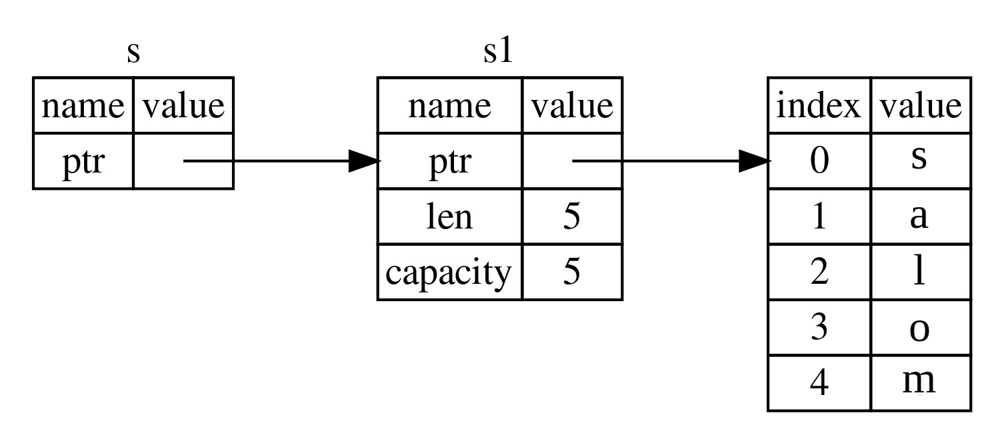

## Reference va Borrowing

Ro'yxat 4-5dagi tuple kodi bilan bog'liq muammo shundaki, biz `String` ni chaqiruvchi funksiyaga qaytarishimiz kerak, shunda biz `uzunlikni_hisoblash` ga chaqiruvdan keyin ham `String` dan foydalanishimiz mumkin, chunki `String` `uzunlikni_hisoblash` ga ko'chirildi. Buning o'rniga biz `String` qiymatiga reference(havola) berishimiz mumkin.

*Reference* pointerga o'xshaydi, chunki u biz ushbu manzilda saqlangan ma'lumotlarga kirish uchun amal qilishimiz mumkin bo'lgan manzildir; bu ma'lumotlar boshqa o'zgaruvchilarga tegishli.
Pointerdan farqli o'laroq, reference ma'lumotnomaning amal qilish muddati davomida ma'lum turdagi yaroqli qiymatni ko'rsatishi kafolatlanadi.

Qiymatga egalik qilish o'rniga parametr sifatida obyektga referencega ega bo'lgan `uzunlikni_hisoblash` funksiyasini qanday aniqlash va ishlatishingiz mumkin:

<span class="filename">Fayl nomi: src/main.rs</span>

```rust
{{#rustdoc_include ../listings/ch04-understanding-ownership/no-listing-07-reference/src/main.rs:all}}
```

Birinchidan, o'zgaruvchilar deklaratsiyasidagi barcha tuple kodi va funksiyani qaytarish qiymati yo'qolganiga e'tibor bering. Ikkinchidan, `&s1` ni `uzunlikni_hisoblash` ga o'tkazamiz va uning definitionida biz `String` emas, `&String`ni olamiz. Ushbu ampersandlar *reference* ni ifodalaydi va ular sizga biron bir qiymatga ownershiplik qilmasdan murojaat qilish imkonini beradi. 4-5-rasmda ushbu tushuncha tasvirlangan.



<span class="caption">4-5-rasm: `&String s` chizmasi `String s1`ga ishora qiladi</span>

> Eslatma: `&` yordamida reference qilishning teskarisi *dereferencing* bo'lib,
> u `*` dereference operatori yordamida amalga oshiriladi. Biz 8-bobda dereference
> operatoridan baʼzi foydalanishni koʻrib chiqamiz va 15-bobda dereference tafsilotlarini 
> muhokama qilamiz.

Keling, bu yerda funksiya chaqiruvini batafsil ko'rib chiqaylik:

```rust
{{#rustdoc_include ../listings/ch04-understanding-ownership/no-listing-07-reference/src/main.rs:here}}
```

`&s1` sintaksisi bizga `s1` qiymatiga *refers* qiluvchi, lekin unga tegishli bo`lmagan reference yaratish imkonini beradi. Unga egalik qilmaganligi sababli, reference foydalanishni to'xtatganda, u ko'rsatgan qiymat o'chirilmaydi.

Xuddi shunday, funksiya imzosi `s` parametrining turi reference ekanligini ko'rsatish uchun `&` dan foydalanadi. Keling, ba'zi tushuntirish izohlarini qo'shamiz:

```rust
{{#rustdoc_include ../listings/ch04-understanding-ownership/no-listing-08-reference-with-annotations/src/main.rs:here}}
```

`s` o'zgaruvchisi amal qiladigan doirasi har qanday funksiya parametrining qamrovi bilan bir xil bo'ladi, lekin `s` foydalanishni to'xtatganda reference  ko'rsatilgan qiymat o'chirilmaydi, chunki `s` ownershipga ega emas. Funksiya referencelarni yaroqli qiymatlar o'rniga parametr sifatida ko'rsatsa, biz ownershipni qaytarish uchun qiymatlarni qaytarishimiz shart emas, chunki bizda hech qachon ownership bo'lmagan.

Malumot yaratish harakatini *borrowing*(qarz olish) deb ataymiz. Haqiqiy hayotda bo'lgani kabi, agar biror kishi biror narsaga ega bo'lsa, siz undan qarz olishingiz mumkin. Ishingiz tugagach, uni qaytarib berishingiz kerak. Siz unga egalik qilmaysiz.

Xo'sh, agar biz borrowing qilgan narsani o'zgartirishga harakat qilsak nima bo'ladi? 4-6 ro'yxatdagi kodni sinab ko'ring. Spoiler ogohlantirish: bu ishlamaydi!

<span class="filename">Fayl nomi: src/main.rs</span>

```rust,ignore,does_not_compile
{{#rustdoc_include ../listings/ch04-understanding-ownership/listing-04-06/src/main.rs}}
```

<span class="caption">Ro'yxat 4-6: Borrow qilingan qiymatni o'zgartirishga urinish</span>

Mana xato:

```console
{{#include ../listings/ch04-understanding-ownership/listing-04-06/output.txt}}
```

O'zgaruvchilar standart bo'yicha o'zgarmas bo'lganidek, referencelar ham shunday. Bizga reference biror narsani o'zgartirishga ruxsat berilmagan.

### O'zgaruvchan Referencelar

Biz 4-6 ro'yxatdagi kodni tuzatishimiz mumkin, buning o'rniga `o'zgaruvchan reference`dan foydalanadigan bir nechta kichik sozlashlar bilan borrow qilingan qiymatni o'zgartirishimiz mumkin:

<span class="filename">Fayl nomi: src/main.rs</span>

```rust
{{#rustdoc_include ../listings/ch04-understanding-ownership/no-listing-09-fixes-listing-04-06/src/main.rs}}
```

Avval `s` ni `mut` qilib o'zgartiramiz. Keyin biz `&mut s` bilan o'zgaruvchan reference yaratamiz, bu yerda biz `change` funksiyasini chaqiramiz va `some_string: &mut String` bilan o'zgaruvchan referencei qabul qilish uchun funksiya signatureni yangilaymiz. Bu `change` funksiyasi olingan qiymatni o'zgartirishini aniq ko'rsatadi.

O'zgaruvchan referencelar bitta katta cheklovga ega: agar sizda qiymatga o'zgaruvchan reference bo'lsa, sizda bu qiymatga boshqa referencelar bo'lishi mumkin emas. `s` ga ikkita o'zgaruvchan reference yaratishga urinayotgan ushbu kod muvaffaqiyatsiz bo'ladi:

<span class="filename">Fayl nomi: src/main.rs</span>

```rust,ignore,does_not_compile
{{#rustdoc_include ../listings/ch04-understanding-ownership/no-listing-10-multiple-mut-not-allowed/src/main.rs:here}}
```

Mana xato:

```console
{{#include ../listings/ch04-understanding-ownership/no-listing-10-multiple-mut-not-allowed/output.txt}}
```

Bu xatolik bu kodning yaroqsiz ekanligini bildiradi, chunki biz bir vaqtning o'zida bir necha marta o'zgaruvchan `s` ni borrow qila ololmaymiz. Birinchi o'zgaruvchan borrow `r1` da bo'lib, u `println!` da ishlatilgunga qadar davom etishi kerak, lekin bu o'zgaruvchan referenceni yaratish va undan foydalanish o'rtasida, biz `r2` da `r1` bilan bir xil ma'lumotlarni olgan boshqa o`zgaruvchan reference yaratishga harakat qildik.

Bir vaqtning o'zida bir xil ma'lumotlarga bir nechta o'zgaruvchan referencelarni oldini oluvchi cheklov mutatsiyaga imkon beradi, lekin juda nazorat ostida. Bu yangi Rustaceanlar bilan kurashadigan narsa, chunki aksariyat tillar xohlagan vaqtda mutatsiyaga o'tishga imkon beradi. Ushbu cheklovning afzalligi shundaki, Rust kompilyatsiya vaqtida data raceni oldini oladi. *Data race* poyga holatiga o'xshaydi va bu uchta xatti-harakatlar sodir bo'lganda sodir bo'ladi:

* Ikki yoki undan ortiq pointerlar bir vaqtning o'zida bir xil ma'lumotlarga kirishadi.
* Pointerlardan kamida bittasi ma'lumotlarga yozish uchun ishlatiladi.
* Ma'lumotlarga kirishni sinxronlashtirish uchun hech qanday mexanizm ishlatilmaydi.

Data race aniqlanmagan xatti-harakatlarga olib keladi va ularni runtimeda kuzatib borishga harakat qilayotganingizda tashxis qo'yish va tuzatish qiyin bo'lishi mumkin; Rust data racelari bilan kodni kompilyatsiya qilishni rad etish orqali bu muammoni oldini oladi!

Har doimgidek, biz *bir vaqtning o'zida* emas, balki bir nechta o'zgaruvchan referencelarga ruxsat beruvchi yangi scope yaratish uchun jingalak qavslardan foydalanishimiz mumkin:

```rust
{{#rustdoc_include ../listings/ch04-understanding-ownership/no-listing-11-muts-in-separate-scopes/src/main.rs:here}}
```

Rust o'zgaruvchan va o'zgarmas referencelarni birlashtirish uchun shunga o'xshash qoidani qo'llaydi.

```rust,ignore,does_not_compile
{{#rustdoc_include ../listings/ch04-understanding-ownership/no-listing-12-immutable-and-mutable-not-allowed/src/main.rs:here}}
```

Mana xato:

```console
{{#include ../listings/ch04-understanding-ownership/no-listing-12-immutable-and-mutable-not-allowed/output.txt}}
```

Voy! Bizda *shuningdek* o'zgaruvchan referencelar bo'lishi mumkin emas, bizda bir xil qiymatga o'zgarmas reference mavjud.

O'zgarmas reference foydalanuvchilari qiymat birdaniga ularning ostidan o'zgarishini kutishmaydi! Biroq, bir nechta o'zgarmas referencelarga ruxsat beriladi, chunki faqat ma'lumotlarni o'qiyotgan hech kim boshqa hech kimning ma'lumotni o'qishiga ta'sir qilish qobiliyatiga ega emas.

E'tibor bering, referencening ko'lami u kiritilgan joydan boshlanadi va oxirgi ishlatilgan vaqtgacha davom etadi. Masalan, ushbu kod kompilyatsiya qilinadi, chunki o'zgarmas referencelarning oxirgi ishlatilishi, `println!`, o'zgaruvchan reference kiritilishidan oldin sodir bo'ladi:

```rust,edition2021
{{#rustdoc_include ../listings/ch04-understanding-ownership/no-listing-13-reference-scope-ends/src/main.rs:here}}
```

`r1` va `r2` o'zgarmas referencelar doirasi `println` dan keyin tugaydi! ular oxirgi marta ishlatiladigan joy, ya'ni o'zgaruvchan referencelar `r3` yaratilishidan oldin. Ushbu doiralar bir-biriga mos kelmaydi, shuning uchun bu kodga ruxsat beriladi: kompilyator reference doirasi tugashidan bir nuqtada endi foydalanilmayotganini aytishi mumkin.

Borrowingdagi xatolar ba'zida asabiylashsa ham, Rust kompilyatori potentsial xatoni erta (runtimeda emas, balki kompilyatsiya vaqtida) ko'rsatib beradi va muammo qayerda ekanligini aniq ko'rsatadi. Keyin nima uchun ma'lumotlaringiz siz o'ylagandek emasligini kuzatishingiz shart emas.

### Dangling Referencelar

Pointerlari bo'lgan tillarda, *dangling pointer*ni - xotiradagi boshqa birovga berilgan bo'lishi mumkin bo'lgan joyga reference qiluvchi pointerni - bu xotiraga pointerni saqlab qolgan holda, xotirani biroz bo'shatish orqali yaratish oson. Rust-da, aksincha, kompilyator referencelar hech qachon dangling referencelar bo'lmasligini kafolatlaydi: agar sizda ba'zi ma'lumotlarga reference bo'lsa, kompilyator ma'lumotlarga referencedan oldin ma'lumotlar doirasi tashqariga chiqmasligini ta'minlaydi.

Keling, Rust ularni kompilyatsiya vaqtida xatosi bilan qanday oldini olishini ko'rish uchun dangling reference yaratishga harakat qilaylik:

<span class="filename">Fayl nomi: src/main.rs</span>

```rust,ignore,does_not_compile
{{#rustdoc_include ../listings/ch04-understanding-ownership/no-listing-14-dangling-reference/src/main.rs}}
```

Mana xato:

```console
{{#include ../listings/ch04-understanding-ownership/no-listing-14-dangling-reference/output.txt}}
```

Ushbu xato xabari biz hali ko'rib chiqmagan xususiyatga ishora qiladi: lifetime. Biz 10-bobda lifetime batafsil muhokama qilamiz. Ammo, agar siz lifetime haqidagi qismlarga e'tibor bermasangiz, xabarda ushbu kod nima uchun muammo ekanligining kaliti mavjud:

```text
this function's return type contains a borrowed value, but there is no value
for it to be borrowed from
```

Keling, `dangle` kodimizning har bir bosqichida nima sodir bo'layotganini batafsil ko'rib chiqaylik:

<span class="filename">Fayl nomi: src/main.rs</span>

```rust,ignore,does_not_compile
{{#rustdoc_include ../listings/ch04-understanding-ownership/no-listing-15-dangling-reference-annotated/src/main.rs:here}}
```

`s` `dangle` ichida yaratilganligi sababli, `dangle` kodi tugagach, `s` ajratiladi. Ammo biz unga referenceni qaytarishga harakat qildik. Bu shuni anglatadiki, bu reference yaroqsiz `String`ga ishora qiladi. Bu yaxshi emas! Rust bizga buni qilishga ruxsat bermaydi.

Bu yerda yechim to'g'ridan-to'g'ri `String` ni return qilishdir:

```rust
{{#rustdoc_include ../listings/ch04-understanding-ownership/no-listing-16-no-dangle/src/main.rs:here}}
```

Bu hech qanday muammosiz ishlaydi. Ownership boshqa joyga ko'chiriladi va hech narsa ajratilmaydi.

### Reference Qoidalari

Keling, referencelar haqida nimalarni muhokama qilganimizni takrorlaymiz:

* Istalgan vaqtda siz *yoki* bitta oʻzgaruvchan referencega *yoki* istalgan miqdordagi oʻzgarmas referencelarga ega boʻlishingiz mumkin.
* Referencelar har doim yaroqli bo'lishi kerak.

Keyinchalik, biz boshqa turdagi referenceni ko'rib chiqamiz: slicelar.
