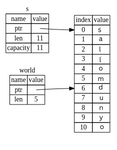

## Slice turi

*Slicelar* butun to'plamga emas, balki to'plamdagi elementlarning qo'shni ketma-ketligiga murojaat qilish imkonini beradi. Slice bir xil referencedir, shuning uchun u ownershipga ega emas.

Bu erda kichik dasturlash muammosi: bo'shliqlar bilan ajratilgan so'zlar qatorini oladigan va shu qatorda topilgan birinchi so'zni qaytaradigan funksiya yozing.
Agar funksiya satrda bo'sh joy topmasa, butun satr bitta so'zdan iborat bo'lishi kerak, shuning uchun butun satr qaytarilishi kerak.

Keling, slicelar hal qiladigan muammoni tushunish uchun ushbu funksiyaning imzosini slicelardan foydalanmasdan qanday yozishni ko'rib chiqaylik:

```rust,ignore
fn birinchi_soz(s: &String) -> ?
```

`birinchi_soz` funksiyasi parametr sifatida `&String` ga ega. Biz ownershiplik qilishni xohlamaymiz, shuning uchun bu yaxshi. Ammo biz nimani return qilishimiz kerak? Bizda satrning *qismi* haqida gapirishning metodi yo'q. Biroq, biz bo'sh joy bilan ko'rsatilgan so'z oxiri indeksini qaytarishimiz mumkin. 4-7 ro'yxatda ko'rsatilganidek, buni sinab ko'raylik.

<span class="filename">Fayl nomi: src/main.rs</span>

```rust
{{#rustdoc_include ../listings/ch04-understanding-ownership/listing-04-07/src/main.rs:here}}
```

<span class="caption">Ro'yxat 4-7: `String` parametriga bayt indeks qiymatini qaytaradigan `birinchi_soz` funksiyasi</span>

Biz `String` elementini element bo'yicha ko'rib chiqishimiz va qiymat bo'sh joy yoki yo'qligini tekshirishimiz kerakligi sababli, `as_bytes` metodi yordamida `String`ni baytlar arrayiga aylantiramiz.

```rust,ignore
{{#rustdoc_include ../listings/ch04-understanding-ownership/listing-04-07/src/main.rs:as_bytes}}
```

Keyinchalik, `iter` metodi yordamida baytlar arrayida iterator yaratamiz:

```rust,ignore
{{#rustdoc_include ../listings/ch04-understanding-ownership/listing-04-07/src/main.rs:iter}}
```
Biz iteratorlarni [13-bobda][ch13]<!-- ignore --> batafsilroq muhokama qilamiz.
Hozircha bilingki, `iter` to‘plamdagi har bir elementni return qiladigan va `enumerate` `iter` natijasini o‘rab, har bir elementni tuplening bir qismi sifatida return qiladigan metoddir. `enumerate` dan qaytarilgan tuplening birinchi elementi indeks, ikkinchi element esa elementga referencedir.
Bu indeksni o'zimiz hisoblashdan ko'ra biroz qulayroqdir.

`enumerate` metodi tupleni qaytarganligi sababli, biz ushbu tupleni destructure qilish uchun patternlardan foydalanishimiz mumkin. Biz [6-bobda][ch6]<!-- ignore --> patternlarni ko'proq muhokama qilamiz. `for` siklida biz tupledagi indeks uchun `i` va bitta bayt uchun `&element` ga ega bo‘lgan patternni belgilaymiz.
Biz `.iter().enumerate()` dan elementga referenceni olganimiz uchun biz patternda `&` dan foydalanamiz.

`for` sikli ichida biz bayt literal sintaksisidan foydalanib, bo'sh joyni ifodalovchi baytni qidiramiz. Agar bo'sh joy topsak, biz pozitsiyani return qilamiz.
Aks holda, `s.len()` yordamida satr uzunligini qaytaramiz.

```rust,ignore
{{#rustdoc_include ../listings/ch04-understanding-ownership/listing-04-07/src/main.rs:inside_for}}
```

Endi bizda satrdagi birinchi so'zning oxirgi indeksini aniqlashning metodi bor, ammo muammo bor. Biz `usize` ni o'z-o'zidan qaytarmoqdamiz, lekin bu `&String` kontekstida faqat meaningful raqam. Boshqacha qilib aytadigan bo'lsak, bu `String` dan alohida qiymat bo'lganligi sababli, uning kelajakda ham amal qilishiga kafolat yo'q. Ro'yxat 4-8da 4-7 ro'yxatdagi `birinchi_soz` funksiyasidan foydalanadigan dasturni ko'rib chiqing.

<span class="filename">Fayl nomi: src/main.rs</span>

```rust
{{#rustdoc_include ../listings/ch04-understanding-ownership/listing-04-08/src/main.rs:here}}
```

<span class="caption">Ro'yxat 4-8: `birinchi_soz` funksiyasini chaqirish natijasida olingan natijani saqlash va keyin `String` tarkibini o'zgartirish</span>

Bu dastur hech qanday xatosiz kompilyatsiya qiladi va agar biz `s.clear()` ga murojat qilgandan keyin `soz` ishlatgan bo'lsak ham shunday bo'lardi. Chunki `soz` `s` holatiga umuman bog‘lanmagan, `soz` hali ham `5` qiymatini o‘z ichiga oladi. Birinchi so‘zni chiqarish uchun biz ushbu `5` qiymatini `s` o‘zgaruvchisi bilan ishlatishimiz mumkin, ammo bu xato bo‘lishi mumkin, chunki `soz`da `5` ni saqlaganimizdan so‘ng `s` tarkibi o‘zgargan.

Having to worry about the index in `word` getting out of sync with the data in
`s` is tedious and error prone! Agar biz `ikkinchi_soz` funksiyasini yozsak, bu indekslarni boshqarish yanada mo'rt bo'ladi. Uning signaturesi quyidagicha ko'rinishi kerak:
```rust,ignore
fn ikkinchi_soz(s: &String) -> (usize, usize) {
```

Endi biz boshlang'ich va tugash indeksini kuzatmoqdamiz va bizda ma'lum bir holatdagi ma'lumotlardan hisoblangan, ammo bu holatga umuman bog'liq bo'lmagan ko'proq qiymatlar mavjud. Bizda bir-biriga bog'liq bo'lmagan uchta o'zgaruvchi mavjud bo'lib, ular sinxronlashtirilishi kerak.

Yaxshiyamki, Rust bu muammoni hal qildi: string slicelar.

### String Slicelar

*string slice* `String` qismiga reference boʻlib, u quyidagicha koʻrinadi:

```rust
{{#rustdoc_include ../listings/ch04-understanding-ownership/no-listing-17-slice/src/main.rs:here}}
```

Butun `String`ga reference oʻrniga `salom` qoʻshimcha `[0..5]` bitida koʻrsatilgan `String` qismiga referencedir. Biz `[starting_index..ending_index]` ni belgilash orqali qavslar ichidagi diapazondan foydalangan holda slicelarni yaratamiz, bu yerda `starting_index` bo'limdagi birinchi pozitsiyadir va `ending_index` slicedagi oxirgi pozitsiyadan bittaga ko'p. Ichkarida, slice ma'lumotlar tuzilmasi `ending_index` minus `starting_index` ga mos keladigan boshlang'ich pozitsiyasini va slice uzunligini saqlaydi. Demak, `let dunyo = &s[6..11];` holatida dunyo so'zi `s` ning 6 indeksidagi baytga ko‘rsatgichni o‘z ichiga olgan bo‘lak bo‘lib, uzunligi 5 ga teng bo‘ladi.

4-6-rasmda bu diagrammada ko'rsatilgan.



<span class="caption">4-6-rasm: `String`ning bir qismiga referal qiluvchi String slice</span>

Rustning `..` diapazoni sintaksisi bilan, agar siz 0 indeksidan boshlamoqchi bo'lsangiz, qiymatni ikki davr oldidan tushirishingiz mumkin. Boshqacha qilib aytganda, ular tengdir:

```rust
let s = String::from("salom");

let slice = &s[0..2];
let slice = &s[..2];
```

Xuddi shu qoidaga ko'ra, agar sizning slicesingiz `String` ning oxirgi baytini o'z ichiga olgan bo'lsa, siz keyingi raqamni qo'yishingiz mumkin. Bu shuni anglatadiki, ular tengdir:

```rust
let s = String::from("salom");

let uzunlik = s.len();

let slice = &s[3..uzunlik];
let slice = &s[3..];
```

Shuningdek, butun satrning bir qismini olish uchun ikkala qiymatni ham tashlab qo'yishingiz mumkin. Shunday qilib, ular teng:

```rust
let s = String::from("salom");

let uzunlik = s.len();

let slice = &s[0..uzunlik];
let slice = &s[..];
```

> Eslatma: String diapazoni indekslari yaroqli UTF-8 belgilar chegaralarida
> bo'lishi kerak. Agar siz ko'p baytli belgi o'rtasida string slice yaratishga
> harakat qilsangiz, dasturingiz xato bilan chiqadi. String slicelarini kiritish uchun
> biz faqat ushbu bo'limda ASCII ni qabul qilamiz; UTF-8 bilan ishlash bo'yicha batafsilroq
> muhokama 8-bobning [”UTF-8 kodlangan matnni satrlar bilan saqlash”][strings]<!-- ignore -->
> bo'limida keltirilgan.


Ushbu ma'lumotlarning barchasini hisobga olgan holda, sliceni qaytarish uchun `birinchi_soz` ni qayta yozamiz. “String slice”ni bildiruvchi tur `&str` sifatida yoziladi:

<span class="filename">Fayl nomi: src/main.rs</span>

```rust
{{#rustdoc_include ../listings/ch04-understanding-ownership/no-listing-18-first-word-slice/src/main.rs:here}}
```

Biz so'z oxiri indeksini 4-7 ro'yxatdagi kabi bo'shliqning birinchi marta paydo bo'lishini qidirib olamiz. Bo'shliqni topganimizda, satrning boshi va bo'sh joy indeksidan boshlang'ich va yakuniy indekslar sifatida foydalanib, satr bo'lagini qaytaramiz.

Endi biz `birinchi_soz` ni chaqirganimizda, biz asosiy ma'lumotlarga bog'langan bitta qiymatni olamiz. Qiymat slicening boshlang'ich nuqtasiga va bo'limdagi elementlar soniga referencedan iborat.

Sliceni return qilish `ikkinchi_soz` funksiyasi uchun ham ishlaydi:

```rust,ignore
fn ikkinchi_soz(s: &String) -> &str {
```

Endi bizda oddiy API mavjud, uni buzish ancha qiyin, chunki kompilyator `String` ga referencelar haqiqiyligini ta'minlaydi. 4-8 ro'yxatdagi dasturdagi xatoni eslaysizmi, biz indeksni birinchi so'zning oxirigacha olib, keyin qatorni o'chirib tashlaganimizda, indeksimiz yaroqsiz edi? Bu kod mantiqan noto'g'ri edi, lekin darhol xatoliklarni ko'rsatmadi. Agar biz birinchi so'z indeksini bo'shatilgan qator bilan ishlatishga harakat qilsak, muammolar keyinroq paydo bo'ladi. Slicelar bu xatoni imkonsiz qiladi va kodimiz bilan bog'liq muammo borligini bizga tezroq bildiradi. `birinchi_soz` slice versiyasidan foydalanish kompilyatsiya vaqtida xatolikka olib keladi:

<span class="filename">Fayl nomi: src/main.rs</span>

```rust,ignore,does_not_compile
{{#rustdoc_include ../listings/ch04-understanding-ownership/no-listing-19-slice-error/src/main.rs:here}}
```

Mana kompilyator xatosi:

```console
{{#include ../listings/ch04-understanding-ownership/no-listing-19-slice-error/output.txt}}
```

Borrowing qoidalarini eslang, agar bizda biror narsaga o'zgarmas reference bo'lsa, biz o'zgaruvchan referenceni ham qabul qila olmaymiz. Chunki `clear` `String`ni qisqartirishi kerak, u o'zgaruvchan referenceni olishi kerak. `clear` chaqiruvidan keyingi `println!` `soz` dagi referencedan foydalanadi, shuning uchun o‘zgarmas reference shu nuqtada faol bo‘lishi kerak. Rust bir vaqtning o'zida `clear` va `soz` dagi o'zgarmas referenceni bir vaqtning o'zida mavjud bo'lishiga yo'l qo'ymaydi va kompilyatsiya bajarilmaydi. Rust nafaqat API-dan foydalanishni osonlashtirdi, balki kompilyatsiya vaqtidagi xatolarning butun sinfini ham yo'q qildi!

<!-- Old heading. Do not remove or links may break. -->
<a id="string-literals-are-slices"></a>

#### String literallar Slice sifatida

Eslatib o'tamiz, biz binary tizimda saqlanadigan string literallari haqida gapirgan edik. Endi biz slicelar haqida bilganimizdan so'ng, biz string literallarini to'g'ri tushunishimiz mumkin:

```rust
let s = "Hello, world!";
```

Bu erda `s` turi `&str`: bu binary faylning o'ziga xos nuqtasiga ishora qiluvchi slice. Shu sababli ham string literallari o'zgarmasdir; `&str` - o'zgarmas reference.

#### Parametrlar sifatida String Slicelar

Siz literal va `String` qiymatlarini olish mumkinligini bilish bizni `birinchi_soz`ni yana bir takomillashtirishga olib keladi va bu uning signaturesi:

```rust,ignore
fn birinchi_soz(s: &String) -> &str {
```

Tajribali Rustacean buni o'rniga 4-9 ro'yxatda ko'rsatilgan signatureni yozadi, chunki bu bizga `&String` qiymatlari va `&str` qiymatlarida bir xil funksiyadan foydalanishga imkon beradi.

```rust,ignore
{{#rustdoc_include ../listings/ch04-understanding-ownership/listing-04-09/src/main.rs:here}}
```

<span class="caption">Ro'yxat 4-9: `birinchi_soz` funksiyasini `s` parametri turi uchun string slicedan foydalanish orqali yaxshilash</span>

Agar bizda string slice bo'lsa, biz uni to'g'ridan-to'g'ri o'tkazishimiz mumkin. Agar bizda `String` bo'lsa, biz `String` slicesini yoki `String` ga referenceni o'tkazishimiz mumkin. Ushbu moslashuvchanlik *deref coercionlari* dan foydalanadi, bu xususiyatni biz 15-bobning [“Funktsiyalar va metodlar bilan Implicit Deref Coercionlari”][deref-coercions]<!--ignore-->  da ko‘rib chiqamiz.

`String` ga reference o‘rniga string sliceni olish funksiyasini belgilash bizning API’ni hech qanday funksionallikni yo‘qotmasdan umumiyroq va foydali qiladi:

<span class="filename">Fayl nomi: src/main.rs</span>

```rust
{{#rustdoc_include ../listings/ch04-understanding-ownership/listing-04-09/src/main.rs:usage}}
```

### Boshqa Slicelar

String slicelari, siz tasavvur qilganingizdek, stringlarga xosdir. Ammo yana umumiy slice turi ham bor. Ushbu arrayni ko'rib chiqing:

```rust
let a = [1, 2, 3, 4, 5];
```

Xuddi biz satrning bir qismiga murojaat qilishni xohlaganimizdek, arrayning bir qismiga murojaat qilishni xohlashimiz mumkin. Biz shunday qilamiz:

```rust
let a = [1, 2, 3, 4, 5];

let slice = &a[1..3];

assert_eq!(slice, &[2, 3]);
```

Ushbu slice `&[i32]` turiga ega. U birinchi element va uzunlikka referenceni saqlash orqali string slicelari kabi ishlaydi. Siz boshqa barcha turdagi to'plamlar uchun bunday slicedan foydalanasiz. 8-bobda vektorlar haqida gapirganda, biz ushbu to'plamlarni batafsil muhokama qilamiz.

## Xulosa

Ownership, borrowing va slicelar tushunchalari kompilyatsiya vaqtida Rust dasturlarida xotira xavfsizligini ta'minlaydi. Rust tili sizga boshqa tizim dasturlash tillari kabi xotiradan foydalanishni boshqarish imkonini beradi, lekin egasi amal qilish doirasidan chiqib ketganda maʼlumotlar egasi avtomatik ravishda ushbu maʼlumotlarni tozalaydi, bu boshqaruvni olish uchun qoʻshimcha kod yozish va debug qilish shart emasligini anglatadi.

Ownership Rustning boshqa ko'plab qismlari qanday ishlashiga ta'sir qiladi, shuning uchun biz bu tushunchalar haqida kitobning qolgan qismida batafsilroq gaplashamiz. Keling, 5-bobga o'tamiz va ma'lumotlar bo'laklarini `struct`da birga guruhlashni ko'rib chiqamiz.

[ch13]: ch13-02-iterators.html
[ch6]: ch06-02-match.html#patterns-that-bind-to-values
[strings]: ch08-02-strings.html#storing-utf-8-encoded-text-with-strings
[deref-coercions]: ch15-02-deref.html#implicit-deref-coercions-with-functions-and-methods
