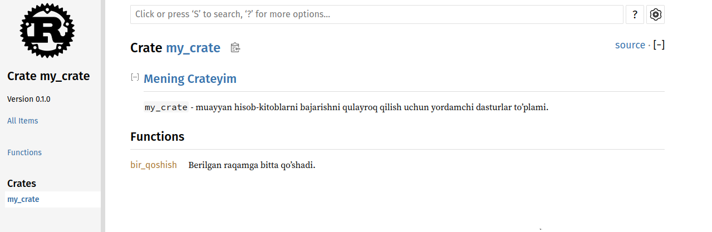

## Crateni Crates.io-ga nashr qilish

Biz [crates.io](https://crates.io/)<!-- ignore --> paketlaridan loyihamizga dependency sifatida foydalandik, lekin siz oʻz paketlaringizni nashr(publish) qilish orqali kodingizni boshqa odamlar bilan ham baham koʻrishingiz mumkin. [crates.io](https://crates.io/)<!-- ignore --> saytidagi crate registri paketlaringizning manba kodini tarqatadi, shuning uchun u birinchi navbatda open source kodni saqlaydi.

Rust va Cargoda publish etilgan paketingizni odamlar topishi va undan foydalanishini osonlashtiradigan funksiyalar mavjud. Biz ushbu xususiyatlarning ba'zilari haqida keyin gaplashamiz va keyin paketni qanday nashr(publish) qilishni tushuntiramiz.

### Foydali hujjatlarga(documentation) sharhlar(comment) qo'yish

Paketlaringizni to'g'ri hujjatlashtirish boshqa foydalanuvchilarga ulardan qanday va qachon foydalanishni bilishga yordam beradi, shuning uchun texnik hujjatlarni yozish uchun vaqt sarflashga arziydi. 3-bobda biz Rust kodini ikkita slash `//` yordamida qanday izohlashni(comment) muhokama qildik. Rust shuningdek, HTML hujjatlarini yaratadigan *documentation comment* deb nomlanuvchi hujjatlar uchun o'ziga xos izohga ega. HTML sizning cratengiz qanday *impelemnent qilinganidan* farqli o'laroq, sizning cratengizdan qanday *foydalanishni* bilishga qiziqqan dasturchilar uchun mo'ljallangan umumiy API elementlari uchun hujjat sharhlari mazmunini ko'rsatadi.

Hujjatlarga sharhlar ikkita o'rniga uchta slashdan foydalaniladi, `///` va matnni formatlash uchun Markdown notationni qo'llab-quvvatlaydi. Hujjatlarga sharhlarni ular hujjatlashtirilayotgan element oldiga qo'ying. 14-1 Ro'yxatda `my_crate` nomli cratedagi `bir_qoshish` funksiyasi uchun hujjat sharhlari ko'rsatilgan.

<span class="filename">Fayl nomi: src/lib.rs</span>

```rust,ignore
{{#rustdoc_include ../listings/ch14-more-about-cargo/listing-14-01/src/lib.rs}}
```

<span class="caption">Ro'yxat 14-1: Funksiya uchun hujjat sharhi(documentation comment</span>

Bu yerda biz `bir_qoshish` funksiyasi nima qilishini tavsiflab beramiz, `Misollar` sarlavhasi bilan bo‘limni boshlaymiz, so‘ngra `bir_qoshish`  funksiyasidan qanday foydalanishni ko‘rsatadigan kodni taqdim etamiz. Biz ushbu hujjat sharhidan HTML hujjatlarini `cargo doc`ni ishga tushirish orqali yaratishimiz mumkin. Bu buyruq Rust bilan tarqatilgan `rustdoc` toolini ishga tushiradi va yaratilgan HTML hujjatlarini *target/doc* jildiga joylashtiradi.

Qulaylik uchun `cargo doc --open` ni ishga tushirish joriy crate hujjatlari uchun HTML-ni yaratadi (shuningdek, cratengizning barcha dependencilari uchun hujjatlar) va natijani veb-brauzerda ochadi. `bir_qoshish` funksiyasiga o‘ting va 14-1-rasmda ko‘rsatilganidek, hujjat sharhlaridagi matn qanday ko‘rsatilishini ko‘rasiz:


<span class="caption">14-1-Rasm: `bir_qoshish` funksiyasi uchun HTML hujjatlari</span>

#### Tez-tez ishlatiladigan bo'limlar

Biz HTML-da `Misollar` sarlavhali bo'lim yaratish uchun 14-1 ro'yxatdagi `# Misollar` Markdown sarlavhasidan foydalandik. Mualliflar o'z hujjatlarida tez-tez foydalanadigan boshqa bo'limlar:

* **Panics**: Hujjat yozilayotan funksiya senariylari panic qo'zg'atishi mumkin. O'z dasturlari panic qo'zg'ashini istamaydigan funksiyaning murojaat qiluvchilari bunday holatlarda funksiyani chaqirmasliklariga ishonch hosil qilishlari kerak.
* **Errors**: Agar funksiya `Result` ni qaytarsa, yuzaga kelishi mumkin bo'lgan xatolar turlarini tavsiflash va bu xatolar qaytarilishiga qanday sharoitlar sabab bo'lishi mumkinligi murojaat qiluvchilar uchun foydali bo'lishi mumkin, shuning uchun ular turli xil xatolarni turli yo'llar bilan hal qilish uchun kod yozishlari mumkin.
* **Safety**: Agar funksiya murojaat qilish uchun `unsafe`  bo'lsa (biz 19-bobda xavfsizlikni muhokama qilamiz), funksiya nima uchun xavfli ekanligini tushuntiruvchi bo'lim bo'lishi kerak va funksiya murojaat qiluvchilar qo'llab-quvvatlashini kutayotgan o'zgarmaslarni qamrab oladi.

Ko'pgina hujjatlar sharhlari ushbu bo'limlarning barchasiga muhtoj emas, ammo bu sizning kodingiz foydalanuvchilari bilishni qiziqtiradigan jihatlarni eslatish uchun yaxshi nazorat ro'yxati.

#### Texnik hujjatlarga sharhlar test sifatida

Hujjatlarga sharhlaringizga(documentation comment) misol kod bloklarini qo'shish kutubxonangizdan(library) qanday foydalanishni ko'rsatishga yordam beradi va bu qo'shimcha bonusga ega bo'ladi: `cargo test` ishga tushirish hujjatlaringizdagi kod misollarini test sifatida ishga tushiradi! Hech narsa misollar bilan hujjatlashtirishdan yaxshiroq emas. Lekin hech narsa ishlamaydigan misollardan ko'ra yomonroq emas, chunki hujjatlar yozilgandan beri kod o'zgargan. Agar biz 14-1 roʻyxatdagi `bir_qoshish` funksiyasi uchun hujjatlar bilan `cargo test` oʻtkazsak, test natijalarida quyidagi boʻlimni koʻramiz:

<!-- manual-regeneration
cd listings/ch14-more-about-cargo/listing-14-01/
cargo test
copy just the doc-tests section below
-->

```text
   Doc-tests my_crate

running 1 test
test src/lib.rs - bir_qoshish (line 5) ... ok

test result: ok. 1 passed; 0 failed; 0 ignored; 0 measured; 0 filtered out; finished in 0.27s
```

Endi funksiyani yoki misolni, misoldagi `assert_eq!` panic qo'zg'atadigan tarzda o'zgartirsak va yana `cargo test` ishga tushirsak, hujjat testlari misol va kod bir-biri bilan sinxronlanmaganligini aniqlaymiz.!

#### O'z ichiga olgan elementlarni sharhlash

Hujjat sharhining uslubi `//!` hujjatni sharhlardan keyingi elementlarga emas, balki sharhlarni o'z ichiga olgan elementga qo'shadi. Biz odatda bu doc izohlaridan cratening ildiz(root) faylida (odatda *src/lib.rs*) yoki modul ichida crateni yoki butun modulni hujjatlash uchun foydalanamiz.

Masalan, `bir_qoshish` funksiyasini o'z ichiga olgan `my_crate` cratesi maqsadini tavsiflovchi hujjatlarni qo'shish uchun biz *src/lib.rs* faylining boshiga `//!` bilan boshlanadigan hujjat sharhlarini qo`shamiz, 14-2 ro'yxatda ko'rsatilganidek:

<span class="filename">Fayl nomi: src/lib.rs</span>

```rust,ignore
{{#rustdoc_include ../listings/ch14-more-about-cargo/listing-14-02/src/lib.rs:here}}
```

<span class="caption">Ro'yxat 14-2: Umuman olganda, `my_crate` cratesi uchun hujjatlar</span>

E'tibor bering, `//!` bilan boshlanadigan oxirgi qatordan keyin hech qanday kod yo'q. Fikrlarni `///` o'rniga `//!` bilan boshlaganimiz sababli, biz ushbu sharhdan keyingi elementni emas, balki ushbu sharhni o'z ichiga olgan elementni hujjatlashtirmoqdamiz. Bunday holda, bu element crate ildizi(root) bo'lgan *src/lib.rs* faylidir. Ushbu sharhlar butun crateni tasvirlaydi.

`cargo doc --open`ni ishga tushirganimizda, bu izohlar 14-2-rasmda ko‘rsatilganidek, `my_crate` hujjatlarining birinchi sahifasida cratedagi public itemlar ro‘yxati ustida ko'rsatiladi:



<span class="caption">14-2-rasm: `my_crate` uchun taqdim etilgan hujjatlar, jumladan, crateni bir butun sifatida tavsiflovchi sharh</span>

Elementlar ichidagi hujjat sharhlari, ayniqsa, cratelar va modullarni tavsiflash uchun foydalidir. Foydalanuvchilarga cratening tashkil etilishini tushunishlariga yordam berish uchun konteynerning umumiy maqsadini tushuntirish uchun ulardan foydalaning.

### `pub use` bilan qulay Public APIni eksport qilish

Public API structi crateni nashr qilishda muhim ahamiyatga ega. Sizning cratengizdan foydalanadigan odamlar structureni sizdan ko'ra kamroq bilishadi va agar sizning cratengiz katta modul ierarxiyasiga ega bo'lsa, ular foydalanmoqchi bo'lgan qismlarni topishda qiyinchiliklarga duch kelishlari mumkin.

7-bobda biz `pub` kalit so‘zi yordamida itemlarni qanday qilib hammaga ochiq(public) qilish va `use` kalit so‘zi bilan obyektlarni qamrovga(scope) kiritishni ko‘rib chiqdik.Biroq, crateni ishlab chiqishda sizga mantiqiy bo'lgan structure foydalanuvchilaringiz uchun unchalik qulay bo'lmasligi mumkin. Siz structlaringizni bir nechta darajalarni o'z ichiga olgan ierarxiyada tartibga solishni xohlashingiz mumkin, ammo keyin siz ierarxiyada chuqur aniqlagan turdan foydalanmoqchi bo'lgan odamlar ushbu tur mavjudligini aniqlashda muammolarga duch kelishlari mumkin.
Ular, shuningdek, `use` `my_crate::FoydaliTur;` o'rniga `use` ``my_crate::biror_modul::boshqa_modul::FoydaliTur;`` ni kiritishlari kerakligidan bezovtalanishi mumkin.

Yaxshi xabar shundaki, agar sturcture boshqa kutubxonadan(library) foydalanishi uchun *qulay bo'lmasa*, ichki organizationgizni o'zgartirishingiz shart emas: Buning o'rniga, `pub use` dan foydalanib, private structuredan farq qiladigan public structure yaratish uchun itemlarni qayta eksport qilishingiz mumkin. Qayta eksport qilish public ob'ektni bir joyda oladi va uni boshqa joyda hammaga ochiq(public) qiladi, go'yo u boshqa joyda aniqlangandek.

Masalan, badiiy tushunchalarni modellashtirish uchun `rassom` nomli kutubxona(library) yaratdik, deylik.
Ushbu kutubxona ichida ikkita modul mavjud: 14-3 roʻyxatda koʻrsatilganidek, `AsosiyRang` va `IkkilamchiRang` nomli ikkita raqamni oʻz ichiga olgan `turlar` moduli va `aralashtirish` nomli funksiyani oʻz ichiga olgan `yordamchi` moduli:
<span class="filename">Fayl nomi: src/lib.rs</span>

```rust,noplayground,test_harness
{{#rustdoc_include ../listings/ch14-more-about-cargo/listing-14-03/src/lib.rs:here}}
```

<span class="caption">Roʻyxat 14-3: `turlar` va `yordamchi` modullariga ajratilgan `rassom` kutubxonasi</span>

14-3-rasmda `cargo doc` tomonidan yaratilgan ushbu crate uchun hujjatlarning bosh sahifasi qanday ko'rinishi ko'rsatilgan:


<span class="caption">14-3-rasm: `turlar` va `yordamchi` modullari ro‘yxati keltirilgan `rassom` hujjatlarining bosh sahifasi</span>

E'tibor bering, `AsosiyRang` va `IkkilamchiRang` turlari birinchi sahifada ko'rsatilmagan va `aralashtirish` funksiyasi ham mavjud emas. Ularni ko'rish uchun `turlar` va `yordamchi` ni bosishimiz kerak.

Ushbu kutubxonaga bog'liq bo'lgan boshqa cratega `rassom` dan elementlarni qamrab oladigan, hozirda aniqlangan modul stryucturedan ko'rsatadigan `use` statementlari kerak bo'ladi. 14-4 roʻyxatda `rassom` cratesidagi `AsosiyRang` va `aralashtirish` elementlaridan foydalanadigan crate misoli koʻrsatilgan:

<span class="filename">Fayl nomi: src/main.rs</span>

```rust,ignore
{{#rustdoc_include ../listings/ch14-more-about-cargo/listing-14-04/src/main.rs}}
```

<span class="caption">Roʻyxat 14-4: `rassom` crate itemlaridan foydalanilgan, ichki stuctureni eksport qilingan crate</span>

`rassom` cratesidan foydalanadigan 14-4-Ro'yxatdagi kod muallifi `AsosiyRang` `turlar` modulida, `aralashtirish` esa `yordamchi` modulida ekanligini aniqlashi kerak edi. `rassom` cratening modul stucturesi undan foydalanadiganlarga qaraganda `rassom` crate ustida ishlayotgan developerlarga ko'proq mos keladi. The internal
structure doesn’t contain any useful information for someone trying to
understand how to use the `art` crate, but rather causes confusion because
developers who use it have to figure out where to look, and must specify the
module names in the `use` statements.
Ichki stuctureda `rassom` cratesidan qanday foydalanishni tushunishga urinayotganlar uchun foydali ma'lumotlar mavjud emas, aksincha, chalkashliklarga sabab bo'ladi, chunki undan foydalanadigan developerlar qayerga qarash kerakligini aniqlashlari kerak va `use` statementlarida modul nomlarini ko'rsatishi kerak.

Ichki organizationni public API’dan olib tashlash uchun biz 14-5 ro‘yxatda ko‘rsatilganidek, top leveldagi elementlarni qayta eksport qilish uchun `pub use` statementlarini qo‘shish uchun 14-3 ro‘yxatdagi `rassom` crate kodini o‘zgartirishimiz mumkin:

<span class="filename">Fayl nomi: src/lib.rs</span>

```rust,ignore
{{#rustdoc_include ../listings/ch14-more-about-cargo/listing-14-05/src/lib.rs:here}}
```

<span class="caption">Ro'yxat 14-5: Elementlarni qayta eksport qilish uchun `pub use` statementlarini qo'shish</span>

Ushbu crate uchun `cargo doc` yaratadigan API hujjatlari Endi 14-4-rasmda ko'rsatilganidek, re-exportlarni birinchi sahifada listga oling va bog'lang, bu `AsosiyRang` va `IkkilamchiRang` turlarini va `aralashtirish` funksiyasini topishni osonlashtiradi.


<span class="caption">14-4-rasm: re-exportlar ro'yxati keltirilgan `rassom` hujjatlarining birinchi sahifasi</span>

`rassom` crate foydalanuvchilari hali ham 14-4 roʻyxatda koʻrsatilganidek, 14-3 roʻyxatdagi ichki(internal) structureni koʻrishlari va foydalanishlari mumkin yoki ular 14-6 roʻyxatda koʻrsatilganidek, 14-5 roʻyxatdagi qulayroq structuredan foydalanishlari mumkin:

<span class="filename">Fayl nomi: src/main.rs</span>

```rust,ignore
{{#rustdoc_include ../listings/ch14-more-about-cargo/listing-14-06/src/main.rs:here}}
```

<span class="caption">Ro'yxat 14-6: `rassom` cratesidan re-export(qayta eksport) qilingan itemlarni ishlatadigan dastur</span>

Ko'plab ichki modullar mavjud bo'lsa, `pub use` bilan top leveldagi turlarni qayta eksport(re-export) qilish cratedan foydalanadigan foydalanuvchilar tajribasida sezilarli o'zgarishlarga olib kelishi mumkin. `pub use` ning yana bir keng tarqalgan qoʻllanilishi bu crate deifinationlarini cratengizning public API qismiga aylantirish uchun joriy cratedagi dependency definitionlarini qayta eksport qilishdir.

Foydali public API stucturesini yaratish fandan ko'ra ko'proq san'atdir va siz foydalanuvchilaringiz uchun eng mos keladigan APIni topish uchun takrorlashingiz mumkin. `pub use` ni tanlash sizga cratengizni ichki stuctureda moslashuvchanlikni beradi va bu ichki stuctureni foydalanuvchilarga taqdim etgan narsadan ajratadi. O'rnatgan ba'zi cratelar kodlarini ko'rib chiqing, ularning ichki tuzilishi(internal structure) public APIdan farq qiladimi yoki yo'qmi.

### Crates.io da account sozlash

Har qanday cratelarni nashr qilishdan oldin [crates.io](https://crates.io/)<!-- ignore --> saytida hisob(account) yaratishingiz va API tokenini olishingiz kerak.
Buning uchun [crates.io](https://crates.io/)<!-- ignore --> saytidagi bosh sahifaga tashrif buyuring va GitHub hisob qaydnomasi(account) orqali tizimga kiring. (GitHub hisobi hozirda talab hisoblanadi, ammo sayt kelajakda hisob yaratishning boshqa usullarini qo'llab-quvvatlashi mumkin.), Tizimga kirganingizdan so'ng,[https://crates.io/me/](https://crates.io/me/)<!-- ignore --> sahifasidagi hisob sozlamalariga tashrif buyuring va API kalitingizni(key) oling. Keyin API kalitingiz bilan `cargo login` buyrug'ini bajaring, masalan:

```console
$ cargo login abcdefghijklmnopqrstuvwxyz012345
```

Bu buyruq Cargoga API tokeningiz haqida xabar beradi va uni *~/.cargo/credentials* da saqlaydi. E'tibor bering, bu token *secret*: uni boshqa hech kim bilan baham ko'rmang. Agar biron-bir sababga ko'ra uni kimdir bilan baham ko'rsangiz, uni bekor qilishingiz va [crates.io](https://crates.io/)<!-- ignore --> saytida yangi token yaratishingiz kerak.

### Yangi cratega metadata qo'shish

Aytaylik, sizda nashr qilmoqchi bo'lgan cratengiz bor. Nashr qilishdan oldin cratening *Cargo.toml* faylining `[package]` boʻlimiga metamaʼlumotlar qoʻshishingiz kerak boʻladi.

Sizning cratengizga noyob nom kerak bo'ladi. Mahalliy(local) miqyosda crate ustida ishlayotganingizda, cratega xohlaganingizcha nom berishingiz mumkin. Biroq, [crates.io](https://crates.io/)<!-- ignore --> saytidagi crate nomlari birinchi kelganda, birinchi navbatda beriladi. Crate nomi olingandan so'ng, boshqa hech kim bu nom bilan crateni nashr eta olmaydi. Crateni nashr etishga urinishdan oldin foydalanmoqchi bo'lgan nomni qidiring. Agar nom ishlatilgan bo'lsa, nashr qilish uchun yangi nomdan foydalanish uchun boshqa nom topib, *Cargo.toml* faylida `[package]` bo'limi ostidagi `name` maydonini tahrirlashingiz kerak bo'ladi:

<span class="filename">Fayl nomi: Cargo.toml</span>

```toml
[package]
name = "kalkulyator"
```

Noyob nom tanlagan bo'lsangiz ham, ushbu nuqtada crateni nashr qilish uchun `cargo publish` ni ishga tushirganingizda, siz ogohlantirish va keyin xatolikni olasiz:

<!-- manual-regeneration
cd listings/ch14-more-about-cargo/listing-14-01/
cargo publish
copy just the relevant lines below
-->

```console
$ cargo publish
    Updating crates.io index
warning: manifest has no description, license, license-file, documentation, homepage or repository.
See https://doc.rust-lang.org/cargo/reference/manifest.html#package-metadata for more info.
--snip--
error: failed to publish to registry at https://crates.io

Caused by:
  the remote server responded with an error: missing or empty metadata fields: description, license. Please see https://doc.rust-lang.org/cargo/reference/manifest.html for how to upload metadata
```

Bu xato, chunki sizda ba'zi muhim ma'lumotlar yetishmayapti: tavsif(description) va litsenziya talab qilinadi, shunda foydalanuvchilar sizning cratengiz nima qilishini va undan qanday shartlar ostida foydalanishlari mumkinligini bilishlari mumkin. *Cargo.toml* ga bir yoki ikki jumladan iborat tavsif(description) qo'shing, chunki u qidiruv natijalarida cratengiz bilan birga ko'rinadi. `license` maydoni uchun siz *litsenziya identifikatorining qiymatini* berishingiz kerak. [Linux
Foundation’s Software Package Data Exchange (SPDX)][spdx] ushbu qiymat uchun foydalanishingiz mumkin bo'lgan identifikatorlarni sanab o'tadi. Masalan, MIT litsenziyasidan foydalangan holda cratengizni litsenziyalaganingizni ko'rsatish uchun `MIT` identifikatorini qo'shing:

<span class="filename">Fayl nomi: Cargo.toml</span>

```toml
[package]
name = "kalkulyator"
license = "MIT"
```

Agar siz SPDX da ko'rinmaydigan litsenziyadan foydalanmoqchi bo'lsangiz, ushbu litsenziya matnini faylga joylashtirishingiz, faylni loyihangizga kiritishingiz kerak, va keyin `license` kalitidan foydalanish oʻrniga oʻsha fayl nomini koʻrsatish uchun `license-file` dan foydalaning.

Loyihangiz uchun qaysi litsenziya to'g'ri kelishi haqidagi ko'rsatmalar ushbu kitob doirasidan tashqarida. Rust hamjamiyatidagi(community) ko'p odamlar o'z loyihalarini Rust bilan bir xil tarzda `MIT OR Apache-2.0` qo'sh litsenziyasidan foydalangan holda litsenziyalashadi. Ushbu amaliyot shuni ko'rsatadiki, loyihangiz uchun bir nechta litsenziyaga ega bo'lish uchun `OR` bilan ajratilgan bir nechta litsenziya identifikatorlarini ham belgilashingiz mumkin.

Noyob nom, versiya, tavsif(description) va litsenziya qoʻshilgan holda nashr etishga tayyor boʻlgan loyiha uchun *Cargo.toml* fayli quyidagicha koʻrinishi mumkin:

<span class="filename">Fayl nomi: Cargo.toml</span>

```toml
[package]
name = "kalkulyator"
version = "0.1.0"
edition = "2021"
description = "Sanoq tizimlari bilan ishlaydigan kalkulyator"
license = "MIT OR Apache-2.0"

[dependencies]
```

[Cargo hujjatlarida](https://doc.rust-lang.org/cargo/) boshqalar sizning cratengizni osongina topishi va undan foydalanishi uchun siz belgilashingiz mumkin bo'lgan boshqa metama'lumotlar tasvirlangan.

### Crates.io-da nashr qilish

Endi siz hisob(account) yaratdingiz, API tokeningizni saqladingiz, cratengiz uchun nom tanladingiz va kerakli metamaʼlumotlarni koʻrsatdingiz, siz nashr(publish) qilishga tayyorsiz! Crateni nashr qilish boshqalar foydalanishi uchun [crates.io](https://crates.io/)<!-- ignore --> saytiga ma'lum bir versiyani yuklaydi.

Ehtiyot bo'ling, chunki nashr *doimiydir(permanent)*. Versiyani hech qachon qayta yozib bo'lmaydi va kodni o'chirib bo'lmaydi.[crates.io](https://crates.io/)<!-- ignore --> -ning asosiy maqsadlaridan biri doimiy kod arxivi bo'lib xizmat qilishdir, shunda [crates.io](https://crates.io/)<!-- ignore -->-dan cratelarga bog'liq bo'lgan barcha loyihalar o'z ishini davom ettiradi. Versiyani o'chirishga ruxsat berish bu maqsadni amalga oshirishni imkonsiz qiladi. Biroq, siz nashr(publish) etishingiz mumkin bo'lgan crate versiyalari soniga cheklov yo'q.

`cargo publish` buyrug'ini qayta ishga tushiring. Endi u muvaffaqiyatli bo'lishi kerak:

<!-- manual-regeneration
go to some valid crate, publish a new version
cargo publish
copy just the relevant lines below
-->

```console
$ cargo publish
    Updating crates.io index
   Packaging kalkulyator v0.1.0 (file:///projects/kalkulyator)
   Verifying kalkulyator v0.1.0 (file:///projects/kalkulyator)
   Compiling kalkulyator v0.1.0
(file:///projects/kalkulyator/target/package/kalkulyator-0.1.0)
    Finished dev [unoptimized + debuginfo] target(s) in 0.19s
   Uploading kalkulyator v0.1.0 (file:///projects/kalkulyator)
```

Tabriklaymiz! Siz endi kodingizni Rust hamjamiyatiga(community) ulashdingiz va
har kim o'z loyihasiga dependency sifatida cratengizni osongina qo'shishi mumkin.

### Mavjud cratening yangi versiyasini nashr qilish

Cratengizga oʻzgartirishlar kiritib, yangi versiyani chiqarishga tayyor boʻlgach, *Cargo.toml* faylida koʻrsatilgan `version` qiymatini oʻzgartirasiz va qayta nashr qilasiz. Siz kiritgan o'zgartirishlar turiga qarab keyingi versiya raqami qanday bo'lishini aniqlash uchun [semantik versiya qoidalaridan][semver] foydalaning.
Keyin yangi versiyani yuklash uchun `cargo publish`ni ishga tushiring.

<!-- Old link, do not remove -->
<a id="removing-versions-from-cratesio-with-cargo-yank"></a>

### Crates.io-dan `cargo yank` bilan eskirgan versiyalar

Cratening oldingi versiyalarini olib tashlamasangiz ham, kelajakdagi loyihalarni ularni yangi dependency sifatida qo'shishning oldini olishingiz mumkin. Bu crate versiyasi bir yoki boshqa sabablarga ko'ra buzilganda foydalidir. Bunday vaziyatlarda Cargo crate versiyasini *yanking(tortib)* olishni qo'llab-quvvatlaydi.

Versiyani yanking o'zgartirish yangi loyihalarning ushbu versiyaga bog'lanishiga to'sqinlik qiladi, lekin shunga qaramay, unga bog'liq bo'lgan barcha mavjud loyihalarni ishlashni davom ettirishga imkon beradi. Aslini olganda, yank degani *Cargo.lock* bilan barcha loyihalar buzilmasligini va kelajakda yaratilgan *Cargo.lock* fayllari yanked versiyasidan foydalanmasligini anglatadi.

Cratening versiyasini tortib olish uchun siz avval nashr qilgan crate jildida  `cargo yank` ni ishga tushiring va qaysi versiyani yank qilishni belgilang. Misol uchun, agar biz `kalkulyator` nomli 1.0.1 versiyasini chop etgan bo'lsak va biz uni yank qilib olmoqchi bo'lsak, `kalkulyator` loyihasi jildida biz quyidagi amllarni bajaramiz:

<!-- manual-regeneration:
cargo yank carol-test --version 2.1.0
cargo yank carol-test --version 2.1.0 --undo
-->

```console
$ cargo yank --vers 1.0.1
    Updating crates.io index
        Yank kalkulyator@1.0.1
```

Buyruqga `--undo` ni qo'shish orqali siz `yank` ni bekor qilishingiz va loyihalarni versiyaga qarab qaytadan boshlashga ruxsat berishingiz mumkin:

```console
$ cargo yank --vers 1.0.1 --undo
    Updating crates.io index
      Unyank kalkulyator@1.0.1
```

Yank *hech qanday kodni o'chirmaydi*. U, masalan, tasodifan yuklangan secretlarni o'chira olmaydi. Agar bu sodir bo'lsa, siz ushbu secretlarni darhol tiklashingiz kerak.

[spdx]: http://spdx.org/licenses/
[semver]: http://semver.org/
